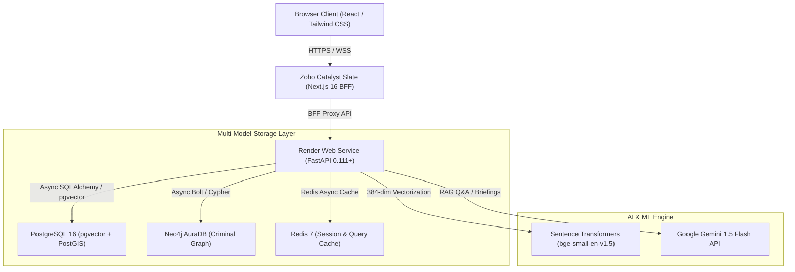

# 🛡️ PAC — PoliceIT Analytics Core

> **AI-Powered Multi-Modal Intelligence Platform for Law Enforcement**
> 
> *Live Cloud Demo*: [https://pac-fehvhyfs.onslate.in](https://pac-fehvhyfs.onslate.in)  
> *API Documentation*: [https://pac-backend-7xbd.onrender.com/api/docs](https://pac-backend-7xbd.onrender.com/api/docs)

---

## 📌 Executive Summary

**PoliceIT Analytics Core (PAC)** is a production-grade multi-modal intelligence platform engineered to transform raw police records and narratives into actionable investigative insights. PAC bridges traditional law enforcement databases with modern vector embeddings, graph topology, spatial clustering, and RAG-grounded generative AI.

---

## 🏛️ System Architecture Topology

---

## ⚡ Core Engineering Capabilities

### 1. 🧬 Crime DNA Vector Embeddings (`pgvector`)
* **384-Dimensional Embeddings**: Modus Operandi (MO) narratives are converted into dense vector embeddings using Sentence Transformers (`bge-small-en-v1.5`).
* **Sub-10ms Cosine Similarity**: Employs an **IVFFlat ANN vector index** in PostgreSQL for fast similarity queries across thousands of historical crime cases.

### 2. 🗺️ Spatial Hotspot Detection (`PostGIS + DBSCAN`)
* **Density-Based Clustering**: Computes geographic hotspot clusters using spatial DBSCAN algorithms directly over PostGIS point geometry (`SRID=4326`).
* **Patrol Directive Generation**: Derives dominant crime types and high-risk time windows for automated police patrol allocation.

### 3. 🕸️ Criminal Network Topology (`Neo4j`)
* **Syndicate & Leader Detection**: Tracks suspect-to-suspect relationships, shared Modus Operandi, gang hierarchies, and cross-district crime networks.
* **Shortest Path & Topology Search**: Solves multi-hop offender connection trees using Cypher query algorithms.

### 4. 🤖 RAG Investigation Assistant (`Google Gemini`)
* **Grounded Case Q&A**: Answers officer natural language queries with context retrieved directly from PostgreSQL vector search and Neo4j graph nodes.
* **Patrol Briefing Generator**: Generates actionable shift briefings tailored to specific police station jurisdictions.

### 5. 🚀 High-Performance Caching Layer (`Redis`)
* **Aggregated Dashboard Summary**: Serves consolidated dashboard metrics (`asyncio.gather`) with a Redis cache layer, returning stats in **< 20ms**.

---

## 🌐 Live Cloud Deployment & Demo Access

The entire platform is hosted on cloud infrastructure requiring **0 local laptop setup**:

| Service | Hosting Provider | URL |
| :--- | :--- | :--- |
| **Frontend Web App** | Zoho Catalyst Slate | [https://pac-fehvhyfs.onslate.in](https://pac-fehvhyfs.onslate.in) |
| **Backend REST API** | Render Web Service | [https://pac-backend-7xbd.onrender.com](https://pac-backend-7xbd.onrender.com) |
| **OpenAPI / Swagger** | Render Web Service | [https://pac-backend-7xbd.onrender.com/api/docs](https://pac-backend-7xbd.onrender.com/api/docs) |

### 🔐 1-Click Evaluation Accounts
Visitors can use the **Quick Sign In** buttons on the login page or enter credentials manually:

| Role | Badge Number | Password | Capabilities |
| :--- | :--- | :--- | :--- |
| 🛡️ **Super Admin** | `ADMIN001` | `password123` | System monitoring, ETL logs, user RBAC |
| 🕵️ **Supervisor (DCP)** | `SUP001` | `password123` | Command centre, hotspot trends, patrol briefings |
| 📊 **Crime Analyst** | `ANA001` | `password123` | Crime DNA, similarity search, network graph |
| 👮 **Field Officer** | `OFF001` | `password123` | FIR registration, my cases, AI assistant |

---

## 📊 Performance Benchmarks

| Metric | Target / Measured Value | Architecture Optimization |
| :--- | :--- | :--- |
| **Vector Similarity Search** | `< 10 ms` | PostgreSQL `pgvector` IVFFlat index |
| **Dashboard Summary Response** | `< 20 ms` (cached) / `< 300 ms` (cold) | Redis in-memory cache + `asyncio.gather` |
| **Graph Shortest Path (3-hop)** | `< 45 ms` | Neo4j Cypher index & memory cache |
| **Spatial DBSCAN Clustering** | `< 120 ms` | PostGIS spatial GIST index |

---

## 👨‍💻 Development & Credits

* **System Architect & Lead Developer**: Built 100% of the technical implementation — including Next.js 16 frontend, FastAPI microservices, PostgreSQL pgvector/PostGIS engines, Neo4j graph topology, Redis caching, and cloud deployments.
* **Hackathon Collaboration**: Conceived and planned during a hackathon challenge with team problem formulation.

---

## 📜 License & Compliance
Designed for government law enforcement intelligence architecture standards (Karnataka State Police demo data schema). All activity logging enforced via security audit middleware under the Information Technology Act, 2000.
