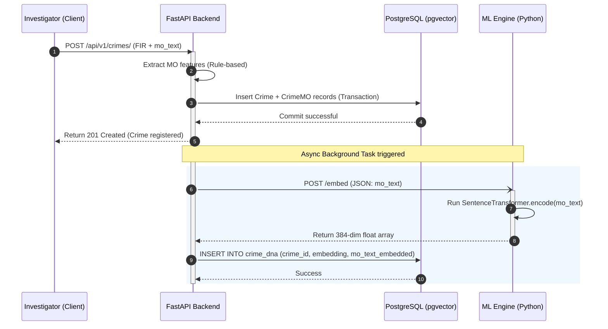

# Implementation Plan: Phase 2 — Crime DNA Pipeline

This plan outlines the architecture, data flow, API contracts, database operations, and sequence diagrams for the Phase 2 Crime DNA pipeline.

---

## 1. System Goals & Overview
The goal of Phase 2 is to implement the **Crime DNA Pipeline**:
1. When a crime is registered, extract structured features using the rule-based extractor (completed in Phase 1).
2. Generate a **384-dimensional semantic embedding** of the unstructured Modus Operandi (MO) narrative using the `all-MiniLM-L6-v2` Sentence Transformers model.
3. Save this embedding in the `crime_dna` table using **pgvector**.
4. Allow investigators to search for behaviorally similar crimes using **cosine similarity** queries.

---

## 2. Decoupled Service Communication Flow

To prevent CPU blockages on the main FastAPI thread, the Sentence Transformers model runs in a separate process (`mlengine`).



---

## 3. Database Operations (pgvector)

We use **pgvector**'s cosine operator to compare embeddings.

### Core Query: Cosine Similarity
To find the top $K$ most similar crimes to a given query crime:
```sql
SELECT 
    c.id, 
    c.fir_number, 
    c.crime_type, 
    c.district,
    1 - (d.embedding <=> :query_embedding) AS similarity_score
FROM crimes c
JOIN crime_dna d ON c.id = d.crime_id
WHERE c.id != :exclude_id
ORDER BY d.embedding <=> :query_embedding
LIMIT :limit;
```
*Note: `<=>` is the pgvector cosine distance operator. Cosine similarity is computed as $1 - \text{cosine\_distance}$.*

### Vector Index Configuration
To accelerate similarity searches, we establish an **IVFFlat** index on the `embedding` column using `vector_cosine_ops`:
```sql
CREATE INDEX ix_crime_dna_embedding 
ON crime_dna USING ivfflat (embedding vector_cosine_ops) 
WITH (lists = 100);
```

---

## 4. Asynchronous Processing Strategy

To ensure crime registration remains fast and reliable:
1. **Background Runner**: We will use FastAPI's built-in `BackgroundTasks` for the initial integration. This avoids Celery/RabbitMQ overhead and runs efficiently in single-host deployments.
2. **Task Flow**:
   - Save the crime to PostgreSQL.
   - Enqueue a background task `generate_crime_dna_task(crime_id, mo_text)`.
   - Respond `201 Created` to the client immediately.
3. **Database Hook / Retry**:
   - The background task makes an HTTP call to `mlengine`.
   - On network failure or timeout, the task retries up to 3 times with exponential backoff.
   - If it fails persistently, it logs a critical error and flags the `CrimeDNA` status (so analysts can trigger manual re-indexing).

---

## 5. API Contracts & Interfaces

### ML Engine Endpoints

#### `POST /embed` (Internal)
Request body:
```json
{
  "texts": ["Suspects cut rear window grill using crowbar at night"],
  "crime_ids": ["8b776c5f-e23a-4467-b50a-f0f512345678"]
}
```
Response body:
```json
{
  "embeddings": [
    [0.0123, -0.0456, ..., 0.1298] 
  ],
  "model": "all-MiniLM-L6-v2",
  "dim": 384
}
```

---

### Backend Endpoints

#### `POST /api/v1/similarity/search` (New)
Allows searching for similar crimes using raw narrative query text.
Request body:
```json
{
  "query_text": "Robbers on pulsar bike snatched chain near bus stand",
  "crime_type": "chain_snatching",
  "district": "Bengaluru Urban",
  "limit": 10
}
```
Response body:
```json
{
  "query_text": "Robbers on pulsar bike snatched chain near bus stand",
  "results": [
    {
      "crime_id": "ddaebf12-4d98-4d45-8d4d-d085ffc864c0",
      "fir_number": "FIR/BLR-URB/2024/0122",
      "crime_type": "chain_snatching",
      "district": "Bengaluru Urban",
      "similarity_score": 0.8924,
      "mo_text": "Two accused on Activa bike snatched gold necklace near Shivaji Park",
      "occurred_at": "2024-06-12T18:30:00Z"
    }
  ]
}
```

#### `GET /api/v1/similarity/crime/{crime_id}` (New)
Finds behaviorally similar crimes matching an existing registered FIR.
Response body:
```json
{
  "source_crime": {
    "crime_id": "ddaebf12-4d98-4d45-8d4d-d085ffc864c0",
    "fir_number": "FIR/BLR-URB/2024/0122",
    "mo_text": "Two accused on Activa bike snatched gold necklace near Shivaji Park"
  },
  "similar_cases": [
    {
      "crime_id": "6c4598d1-12ef-4abc-9922-22df11451a99",
      "fir_number": "FIR/MYS/2024/0009",
      "similarity_score": 0.8142,
      "mo_text": "Snatched gold chain from lady walking near main street and escaped on a pulsar"
    }
  ]
}
```

---

## 6. Error Handling & Robustness

1. **Network Outages**: If the backend cannot reach the `mlengine` during async generation, the background worker schedules a retry.
2. **Missing Embeddings**: If an officer queries similarity before the background task completes, the backend queries Postgres and defaults to rule-based filtering (explainable fallback).
3. **HTTP Client Timeout**: Uses `httpx.AsyncClient` with a strict `10.0` second timeout.

---

## 7. Open Questions

> [!IMPORTANT]
> **GPU vs CPU for ML Engine**: Since `all-MiniLM-L6-v2` is small (~90MB), running it on CPU inside the docker container is very fast (~10-20ms per inference). Should we optimize for GPU execution or stick with default CPU execution? (Stick with CPU is recommended for easy deployment).
